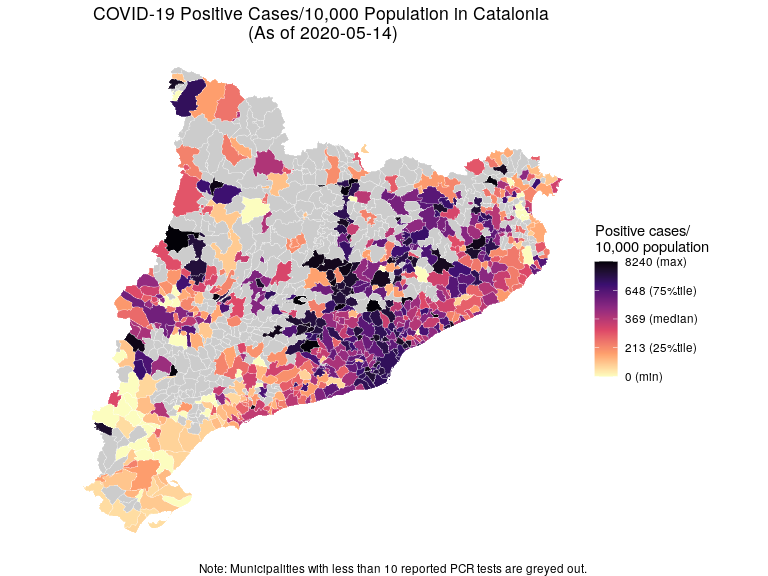

Visualize COVID-19 PCR Test Data
================
Gento Kato
May 15, 2020

# Preparation

``` r
## Clear Workspace
rm(list=ls())

## Set Working Directory (Automatically to Project Home) ##
library(rprojroot)
if (rstudioapi::isAvailable()==TRUE) {
  setwd(dirname(rstudioapi::getActiveDocumentContext()$path)); 
} 
projdir <- find_root(has_file("thisishome.txt"))
cat(paste("Working Directory Set to:\n",projdir))
```

    ## Working Directory Set to:
    ##  /home/gentok/GoogleDrive/Projects/Coronavirus_Project/Coronavirus_spain

``` r
setwd(projdir)

## Plots ## 
require(sf)
require(rmapshaper)
require(ggplot2)
require(dplyr)

# Date_analy <- Date_analy_simple <- "latest"
Date_analy <- "2020-05-14"
Date_analy_simple <- gsub("-","", Date_analy)
Date_analy
```

    ## [1] "2020-05-14"

``` r
## Import Relevant Data
granddt <- readRDS(paste0(projdir,"/data/granddt_",Date_analy_simple,".rds"))
shapedt <- readRDS(paste0(projdir,"/data/shapefile/shape_cataluna_rev.rds")) %>% 
  filter(mundesc != "(altres municipis)")
print(object.size(shapedt), units="Mb")
```

    ## 23.7 Mb

``` r
shapedt_simple <- ms_simplify(shapedt) %>% st_as_sf()
print(object.size(shapedt_simple), units="Mb")
```

    ## 2.3 Mb

``` r
# Merge ALl Data
granddt <- granddt %>% 
  filter(Data==max(Data)) %>%
  inner_join(shapedt_simple, by = c("mundesc"="mundesc"))
target <- granddt
```

# Map Plots

``` r
## Limits COVID-19 Data to Those with >=10 Tests

## Positive Rate
target$posrate <- ifelse(granddt$test<10, NA, granddt$posrate)
plabs <- paste0(sprintf("%.1f", quantile(target$posrate, probs=c(0,0.25,0.5,0.75,1), na.rm=T)),
                c(" (min)"," (25%tile)"," (median)"," (75%tile)"," (max)"))
p <- ggplot(target) + 
  geom_sf(aes(geometry=geometry, fill=percent_rank(posrate)), color="white", size=0.1) + 
  scale_fill_viridis_c(name="Positive rate (%)", option="A", direction=-1, 
                       breaks = c(0,0.25,0.5,0.75,1), labels = plabs,
                       na.value = "grey80") + 
  labs(title=paste0("COVID-19 Positive Rate in Catalonia \n(As of ", max(granddt$Data), ")"),
       caption="Note: Municipalities with less than 10 reported PCR tests are greyed out.") +
  theme_void() + theme(plot.title = element_text(hjust=0.5))
```

``` r
p
```

<!-- -->

``` r
ggsave(paste0(projdir,"/out/map_posrate_",Date_analy_simple,".png"), p, width=8, height=6)
ggsave(paste0(projdir,"/out/map_posrate_",Date_analy_simple,".pdf"), p, width=8, height=6)
ggsave(paste0(projdir,"/out/ForArticle/map_posrate_wotitle_",Date_analy_simple,".png"), 
       p + labs(title = NULL, caption = NULL), width=8, height=6)
ggsave(paste0(projdir,"/out/ForArticle/map_posrate_wotitle_",Date_analy_simple,".pdf"), 
       p + labs(title = NULL, caption = NULL), width=8, height=6)
```

``` r
## Positive Cases / 10k Population
target$pos_100k <- ifelse(granddt$test<10, NA, granddt$pos_100k)
plabs <- paste0(sprintf("%.0f", quantile(target$pos_100k, probs=c(0,0.25,0.5,0.75,1), na.rm=T)),
               c(" (min)"," (25%tile)"," (median)"," (75%tile)"," (max)"))
p <- ggplot(target) + 
  geom_sf(aes(geometry=geometry, fill=percent_rank(pos_100k)), color="white", size=0.1) + 
  scale_fill_viridis_c(name="Positive cases/\n10,000 population", option="A", direction=-1, 
                       breaks = c(0,0.25,0.5,0.75,1), labels = plabs,
                       na.value = "grey80") + 
  labs(title=paste0("COVID-19 Positive Cases/10,000 Population in Catalonia \n(As of ", max(granddt$Data), ")"),
       caption="Note: Municipalities with less than 10 reported PCR tests are greyed out.") +
  theme_void() + theme(plot.title = element_text(hjust=0.5))
```

``` r
p
```

<!-- -->

``` r
ggsave(paste0(projdir,"/out/map_pos_",Date_analy_simple,".png"), p, width=8, height=6)
ggsave(paste0(projdir,"/out/map_pos_",Date_analy_simple,".pdf"), p, width=8, height=6)
ggsave(paste0(projdir,"/out/ForArticle/map_pos_wotitle_",Date_analy_simple,".png"), 
       p + labs(title = NULL, caption = NULL), width=8, height=6)
ggsave(paste0(projdir,"/out/ForArticle/map_pos_wotitle_",Date_analy_simple,".pdf"), 
       p + labs(title = NULL, caption = NULL), width=8, height=6)
```

``` r
## Tested Cases / 10k Population
target$test_100k <- ifelse(granddt$test<10, NA, granddt$test_100k)
plabs <- paste0(sprintf("%.0f", quantile(target$test_100k, probs=c(0,0.25,0.5,0.75,1), na.rm=T)),
                c(" (min)"," (25%tile)"," (median)"," (75%tile)"," (max)"))
p <- ggplot(target) + 
  geom_sf(aes(geometry=geometry, fill=percent_rank(test_100k)), color="white", size=0.1) + 
  scale_fill_viridis_c(name="Tested cases/\n10,000 population", option="A", direction=-1, 
                       breaks = c(0,0.25,0.5,0.75,1), labels = plabs,
                       na.value = "grey80") + 
  labs(title=paste0("COVID-19 Tested Cases/10,000 Population in Catalonia \n(As of ", max(granddt$Data), ")"),
       caption="Note: Municipalities with less than 10 reported PCR tests are greyed out.") +
  theme_void() + theme(plot.title = element_text(hjust=0.5))
```

``` r
p
```

<!-- -->

``` r
ggsave(paste0(projdir,"/out/map_test_",Date_analy_simple,".png"), p, width=8, height=6)
ggsave(paste0(projdir,"/out/map_test_",Date_analy_simple,".pdf"), p, width=8, height=6)
ggsave(paste0(projdir,"/out/ForArticle/map_test_wotitle_",Date_analy_simple,".png"), 
       p + labs(title = NULL, caption = NULL), width=8, height=6)
ggsave(paste0(projdir,"/out/ForArticle/map_test_wotitle_",Date_analy_simple,".pdf"), 
       p + labs(title = NULL, caption = NULL), width=8, height=6)

## Registered Unemployment Rate
plabs <- paste0(sprintf("%.1f", quantile(target$regunemprate, probs=c(0,0.25,0.5,0.75,1), na.rm=T)),
                c(" (min)"," (25%tile)"," (median)"," (75%tile)"," (max)"))
p <- ggplot(target) + 
  geom_sf(aes(geometry=geometry, fill=percent_rank(regunemprate)), color="white", size=0.1) + 
  scale_fill_viridis_c(name="Registered unemployment in \npop. of age 15 to 65 (%)", 
                       option="A", direction=-1, 
                       breaks = c(0,0.25,0.5,0.75,1), labels = plabs,
                       na.value = "grey80") + 
  labs(title="Unemployment Rate in Catalonia (2019 Average)") +
  theme_void() + theme(plot.title = element_text(hjust=0.5))
```

``` r
p
```

<!-- -->

``` r
ggsave(paste0(projdir,"/out/map_regunemprate_",Date_analy_simple,".png"), p, width=8, height=6)
ggsave(paste0(projdir,"/out/map_regunemprate_",Date_analy_simple,".pdf"), p, width=8, height=6)
ggsave(paste0(projdir,"/out/ForArticle/map_regunemprate_wotitle_",Date_analy_simple,".png"), 
       p + labs(title = NULL, caption = NULL), width=8, height=6)
ggsave(paste0(projdir,"/out/ForArticle/map_regunemprate_wotitle_",Date_analy_simple,".pdf"), 
       p + labs(title = NULL, caption = NULL), width=8, height=6)

## Alternative Unemployment Rate
plabs <- paste0(sprintf("%.1f", quantile(target$unemprate, probs=c(0,0.25,0.5,0.75,1), na.rm=T)),
                c(" (min)"," (25%tile)"," (median)"," (75%tile)"," (max)"))
p <- ggplot(target) + 
  geom_sf(aes(geometry=geometry, fill=percent_rank(unemprate)), color="white", size=0.1) + 
  scale_fill_viridis_c(name="Unemployment in \nactive population (%)", 
                       option="A", direction=-1, 
                       breaks = c(0,0.25,0.5,0.75,1), labels = plabs,
                       na.value = "grey80") + 
  labs(title="Unemployment Rate in Catalonia (2011 Alternative Measurement)") +
  theme_void() + theme(plot.title = element_text(hjust=0.5))
```

``` r
p
```

<!-- -->

``` r
ggsave(paste0(projdir,"/out/map_unemprate_",Date_analy_simple,".png"), p, width=8, height=6)
ggsave(paste0(projdir,"/out/map_unemprate_",Date_analy_simple,".pdf"), p, width=8, height=6)
ggsave(paste0(projdir,"/out/ForArticle/map_unemprate_wotitle_",Date_analy_simple,".png"), 
       p + labs(title = NULL, caption = NULL), width=8, height=6)
ggsave(paste0(projdir,"/out/ForArticle/map_unemprate_wotitle_",Date_analy_simple,".pdf"), 
       p + labs(title = NULL, caption = NULL), width=8, height=6)

## Taxable Base Income
plabs <- paste0(sprintf("%.0f", quantile(target$taxbaseincome, probs=c(0,0.25,0.5,0.75,1), na.rm=T)),
                c(" (min)"," (25%tile)"," (median)"," (75%tile)"," (max)"))
p <- ggplot(target) + 
  geom_sf(aes(geometry=geometry, fill=percent_rank(taxbaseincome)), color="white", size=0.1) + 
  scale_fill_viridis_c(name="Av. taxable base income \n(in 10k euro)", 
                       option="A", direction=-1, 
                       breaks = c(0,0.25,0.5,0.75,1), labels = plabs,
                       na.value = "grey80") + 
  labs(title="Average Taxable Base Income in Catalonia (2017)") +
  theme_void() + theme(plot.title = element_text(hjust=0.5))
```

``` r
p
```

<!-- -->

``` r
ggsave(paste0(projdir,"/out/map_taxbaseincome_",Date_analy_simple,".png"), p, width=8, height=6)
ggsave(paste0(projdir,"/out/map_taxbaseincome_",Date_analy_simple,".pdf"), p, width=8, height=6)
ggsave(paste0(projdir,"/out/ForArticle/map_taxbaseincome_wotitle_",Date_analy_simple,".png"), 
       p + labs(title = NULL, caption = NULL), width=8, height=6)
ggsave(paste0(projdir,"/out/ForArticle/map_taxbaseincome_wotitle_",Date_analy_simple,".pdf"), 
       p + labs(title = NULL, caption = NULL), width=8, height=6)

## Proportion Living In Small Housing
plabs <- paste0(sprintf("%.1f", quantile(target$prop_smallhouse, probs=c(0,0.25,0.5,0.75,1), na.rm=T)),
                c(" (min)"," (25%tile)"," (median)"," (75%tile)"," (max)"))
p <- ggplot(target) + 
  geom_sf(aes(geometry=geometry, fill=percent_rank(prop_smallhouse)), color="white", size=0.1) + 
  scale_fill_viridis_c(name="Residence 90 sq. m \nor smaller (%)", 
                       option="A", direction=-1, 
                       breaks = c(0,0.25,0.5,0.75,0.99), labels = plabs,
                       na.value = "grey80") + 
  labs(title="Proportion of Residents Living in Small Housing \nin Catalonia (2011 Census)") +
  theme_void() + theme(plot.title = element_text(hjust=0.5))
```

``` r
p
```

<!-- -->

``` r
ggsave(paste0(projdir,"/out/map_smallhouse_",Date_analy_simple,".png"), p, width=8, height=6)
ggsave(paste0(projdir,"/out/map_smallhouse_",Date_analy_simple,".pdf"), p, width=8, height=6)
ggsave(paste0(projdir,"/out/ForArticle/map_smallhouse_wotitle_",Date_analy_simple,".png"), 
       p + labs(title = NULL, caption = NULL), width=8, height=6)
ggsave(paste0(projdir,"/out/ForArticle/map_smallhouse_wotitle_",Date_analy_simple,".pdf"), 
       p + labs(title = NULL, caption = NULL), width=8, height=6)

## Proportion of Immigrants out of EU
plabs <- paste0(sprintf("%.1f", quantile(target$prop_immig_noEU, probs=c(0,0.25,0.5,0.75,1), na.rm=T)),
                c(" (min)"," (25%tile)"," (median)"," (75%tile)"," (max)"))
p <- ggplot(target) + 
  geom_sf(aes(geometry=geometry, fill=percent_rank(prop_immig_noEU)), color="white", size=0.1) + 
  scale_fill_viridis_c(name="Immigrants from \nout of EU (%)", 
                       option="A", direction=-1, 
                       breaks = c(0,0.25,0.5,0.75,1), labels = plabs,
                       na.value = "grey80") + 
  labs(title="Immigrants from Out of EU in Catalonia (2018)") +
  theme_void() + theme(plot.title = element_text(hjust=0.5))
```

``` r
p
```

<!-- -->

``` r
ggsave(paste0(projdir,"/out/map_immig_noEU_",Date_analy_simple,".png"), p, width=8, height=6)
ggsave(paste0(projdir,"/out/map_immig_noEU_",Date_analy_simple,".pdf"), p, width=8, height=6)
ggsave(paste0(projdir,"/out/ForArticle/map_immig_noEU_wotitle_",Date_analy_simple,".png"), 
       p + labs(title = NULL, caption = NULL), width=8, height=6)
ggsave(paste0(projdir,"/out/ForArticle/map_immig_noEU_wotitle_",Date_analy_simple,".pdf"), 
       p + labs(title = NULL, caption = NULL), width=8, height=6)

## Proportion of Service Industry Workers
plabs <- paste0(sprintf("%.1f", quantile(target$prop_service, probs=c(0,0.25,0.5,0.75,1), na.rm=T)),
                c(" (min)"," (25%tile)"," (median)"," (75%tile)"," (max)"))
p <- ggplot(target) + 
  geom_sf(aes(geometry=geometry, fill=percent_rank(prop_service)), color="white", size=0.1) + 
  scale_fill_viridis_c(name="Working in \nservice industry (%)", 
                       option="A", direction=-1, 
                       breaks = c(0,0.25,0.5,0.75,0.96), labels = plabs,
                       na.value = "grey80") + 
  labs(title="Proportion of Service Industry Workers in Catalonia (2018)") +
  theme_void() + theme(plot.title = element_text(hjust=0.5))
```

``` r
p
```

<!-- -->

``` r
ggsave(paste0(projdir,"/out/map_service_",Date_analy_simple,".png"), p, width=8, height=6)
ggsave(paste0(projdir,"/out/map_service_",Date_analy_simple,".pdf"), p, width=8, height=6)
ggsave(paste0(projdir,"/out/ForArticle/map_service_wotitle_",Date_analy_simple,".png"), 
       p + labs(title = NULL, caption = NULL), width=8, height=6)
ggsave(paste0(projdir,"/out/ForArticle/map_service_wotitle_",Date_analy_simple,".pdf"), 
       p + labs(title = NULL, caption = NULL), width=8, height=6)

## Crude Death Rate (2018)
plabs <- paste0(sprintf("%.1f", quantile(target$deathrate, probs=c(0,0.25,0.5,0.75,1), na.rm=T)),
                c(" (min)"," (25%tile)"," (median)"," (75%tile)"," (max)"))
p <- ggplot(target) + 
  geom_sf(aes(geometry=geometry, fill=percent_rank(deathrate)), color="white", size=0.1) + 
  scale_fill_viridis_c(name="Crude death rate (2018)\n(death/1000 pop.)", 
                       option="A", direction=-1, 
                       breaks = c(0,0.25,0.5,0.75,1), labels = plabs,
                       na.value = "grey80") + 
  labs(title="Crude Death Rates in Catalonia (2018)") +
  theme_void() + theme(plot.title = element_text(hjust=0.5))
```

``` r
p
```

<!-- -->

``` r
ggsave(paste0(projdir,"/out/map_deathrate_",Date_analy_simple,".png"), p, width=8, height=6)
ggsave(paste0(projdir,"/out/map_deathrate_",Date_analy_simple,".pdf"), p, width=8, height=6)
ggsave(paste0(projdir,"/out/ForArticle/map_deathrate_wotitle_",Date_analy_simple,".png"), 
       p + labs(title = NULL, caption = NULL), width=8, height=6)
ggsave(paste0(projdir,"/out/ForArticle/map_deathrate_wotitle_",Date_analy_simple,".pdf"), 
       p + labs(title = NULL, caption = NULL), width=8, height=6)

## Proportion of 65+ Residents
plabs <- paste0(sprintf("%.1f", quantile(target$poppr_65plus, probs=c(0,0.25,0.5,0.75,1), na.rm=T)),
                c(" (min)"," (25%tile)"," (median)"," (75%tile)"," (max)"))
p <- ggplot(target) + 
  geom_sf(aes(geometry=geometry, fill=percent_rank(poppr_65plus)), color="white", size=0.1) + 
  scale_fill_viridis_c(name="Proportion of residents\nwith age 65+ (%)", option="A", direction=-1,
                       breaks = c(0,0.25,0.5,0.75,1), labels = plabs,
                       na.value = "grey80") + 
  labs(title="Proportion of Elderly Residents in Catalonia (2019)") +
  theme_void() + theme(plot.title = element_text(hjust=0.5))
```

``` r
p
```

<!-- -->

``` r
ggsave(paste0(projdir,"/out/map_poppr_65plus_",Date_analy_simple,".png"), p, width=8, height=6)
ggsave(paste0(projdir,"/out/map_poppr_65plus_",Date_analy_simple,".pdf"), p, width=8, height=6)
ggsave(paste0(projdir,"/out/ForArticle/map_poppr_65plus_wotitle_",Date_analy_simple,".png"), 
       p + labs(title = NULL, caption = NULL), width=8, height=6)
ggsave(paste0(projdir,"/out/ForArticle/map_poppr_65plus_wotitle_",Date_analy_simple,".pdf"), 
       p + labs(title = NULL, caption = NULL), width=8, height=6)

## Proportion of University Educated
plabs <- paste0(sprintf("%.1f", quantile(target$prop_univ, probs=c(0,0.25,0.5,0.75,1), na.rm=T)),
                c(" (min)"," (25%tile)"," (median)"," (75%tile)"," (max)"))
p <- ggplot(target) + 
  geom_sf(aes(geometry=geometry, fill=percent_rank(prop_univ)), color="white", size=0.1) + 
  scale_fill_viridis_c(name="Attended university in \nage 16+ pop. (%)", 
                       option="A", direction=-1, 
                       breaks = c(0,0.25,0.5,0.75,1), labels = plabs,
                       na.value = "grey80") + 
  labs(title="Proportion of University Educated in Catalonia (2011 Census)") +
  theme_void() + theme(plot.title = element_text(hjust=0.5))
```

``` r
p
```

<!-- -->

``` r
ggsave(paste0(projdir,"/out/map_univ_",Date_analy_simple,".png"), p, width=8, height=6)
ggsave(paste0(projdir,"/out/map_univ_",Date_analy_simple,".pdf"), p, width=8, height=6)
ggsave(paste0(projdir,"/out/ForArticle/map_univ_wotitle_",Date_analy_simple,".png"), 
       p + labs(title = NULL, caption = NULL), width=8, height=6)
ggsave(paste0(projdir,"/out/ForArticle/map_univ_wotitle_",Date_analy_simple,".pdf"), 
       p + labs(title = NULL, caption = NULL), width=8, height=6)

## Population
plabs <- paste0(sprintf("%.0f", quantile(target$pop, probs=c(0,0.25,0.5,0.75,1), na.rm=T)),
                c(" (min)"," (25%tile)"," (median)"," (75%tile)"," (max)"))
p <- ggplot(target) + 
  geom_sf(aes(geometry=geometry, fill=percent_rank(pop)), color="white", size=0.1) + 
  scale_fill_viridis_c(name="Population", option="A", direction=-1,
                       breaks = c(0,0.25,0.5,0.75,1), labels = plabs,
                       na.value = "grey80") + 
  labs(title="Population in Catalonia (2019)") +
  theme_void() + theme(plot.title = element_text(hjust=0.5))
```

``` r
p
```

<!-- -->

``` r
ggsave(paste0(projdir,"/out/map_pop_",Date_analy_simple,".png"), p, width=8, height=6)
ggsave(paste0(projdir,"/out/map_pop_",Date_analy_simple,".pdf"), p, width=8, height=6)
ggsave(paste0(projdir,"/out/ForArticle/map_pop_wotitle_",Date_analy_simple,".png"), 
       p + labs(title = NULL, caption = NULL), width=8, height=6)
ggsave(paste0(projdir,"/out/ForArticle/map_pop_wotitle_",Date_analy_simple,".pdf"), 
       p + labs(title = NULL, caption = NULL), width=8, height=6)

## Population Density
plabs <- paste0(sprintf("%.0f", quantile(target$popdens, probs=c(0,0.25,0.5,0.75,1), na.rm=T)),
                c(" (min)"," (25%tile)"," (median)"," (75%tile)"," (max)"))
p <- ggplot(target) + 
  geom_sf(aes(geometry=geometry, fill=percent_rank(popdens)), color="white", size=0.1) + 
  scale_fill_viridis_c(name="Population density \n(per sq. km)", option="A", direction=-1,
                       breaks = c(0,0.25,0.5,0.75,1), labels = plabs,
                       na.value = "grey80") + 
  labs(title="Population Density in Catalonia (2019)") +
  theme_void() + theme(plot.title = element_text(hjust=0.5))
```

``` r
p
```

<!-- -->

``` r
ggsave(paste0(projdir,"/out/map_popdens_",Date_analy_simple,".png"), p, width=8, height=6)
ggsave(paste0(projdir,"/out/map_popdens_",Date_analy_simple,".pdf"), p, width=8, height=6)
ggsave(paste0(projdir,"/out/ForArticle/map_popdens_wotitle_",Date_analy_simple,".png"), 
       p + labs(title = NULL, caption = NULL), width=8, height=6)
ggsave(paste0(projdir,"/out/ForArticle/map_popdens_wotitle_",Date_analy_simple,".pdf"), 
       p + labs(title = NULL, caption = NULL), width=8, height=6)

## Average Number in House Hold
plabs <- paste0(sprintf("%.1f", quantile(target$mean_numhh_census, probs=c(0,0.25,0.5,0.75,1), na.rm=T)),
                c(" (min)"," (25%tile)"," (median)"," (75%tile)"," (max)"))
p <- ggplot(target) + 
  geom_sf(aes(geometry=geometry, fill=percent_rank(mean_numhh_census)), color="white", size=0.1) + 
  scale_fill_viridis_c(name="Av. number of members \nin a household", 
                       option="A", direction=-1, 
                       breaks = c(0,0.25,0.5,0.75,0.99), labels = plabs,
                       na.value = "grey80") + 
  labs(title="Average Household Size in Catalonia (2011 Census)") +
  theme_void() + theme(plot.title = element_text(hjust=0.5))
```

``` r
p
```

<!-- -->

``` r
ggsave(paste0(projdir,"/out/map_numhh_",Date_analy_simple,".png"), p, width=8, height=6)
ggsave(paste0(projdir,"/out/map_numhh_",Date_analy_simple,".pdf"), p, width=8, height=6)
ggsave(paste0(projdir,"/out/ForArticle/map_numhh_wotitle_",Date_analy_simple,".png"), 
       p + labs(title = NULL, caption = NULL), width=8, height=6)
ggsave(paste0(projdir,"/out/ForArticle/map_numhh_wotitle_",Date_analy_simple,".pdf"), 
       p + labs(title = NULL, caption = NULL), width=8, height=6)
```
